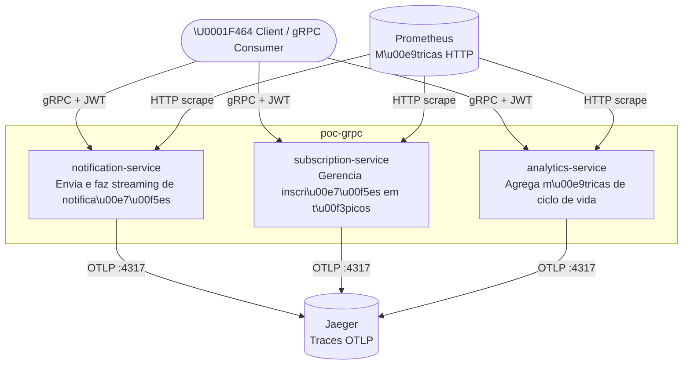
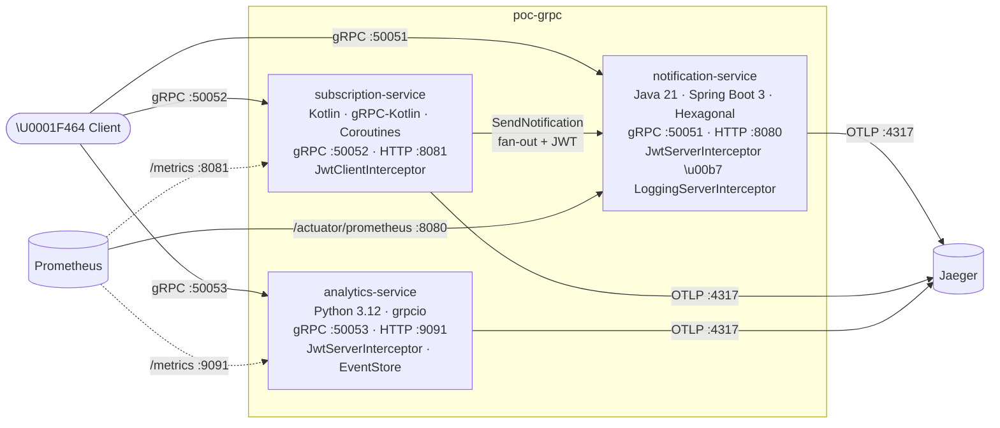
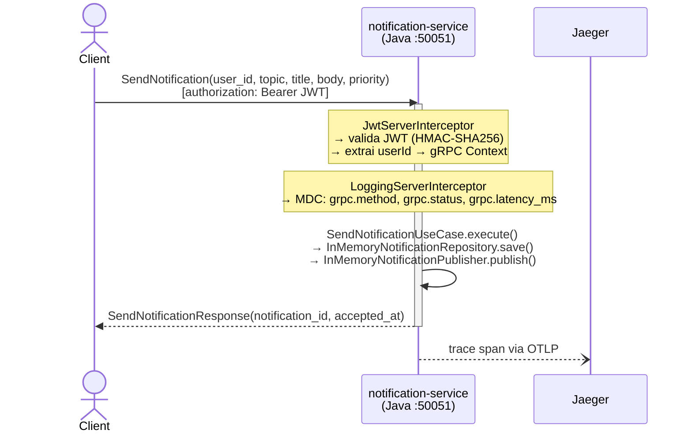
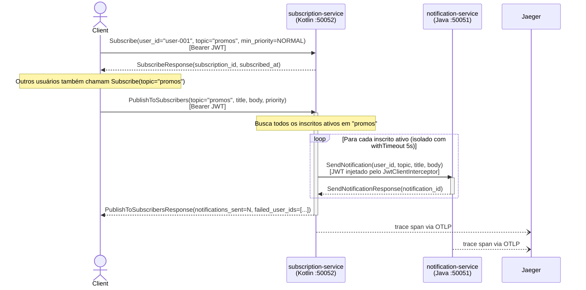
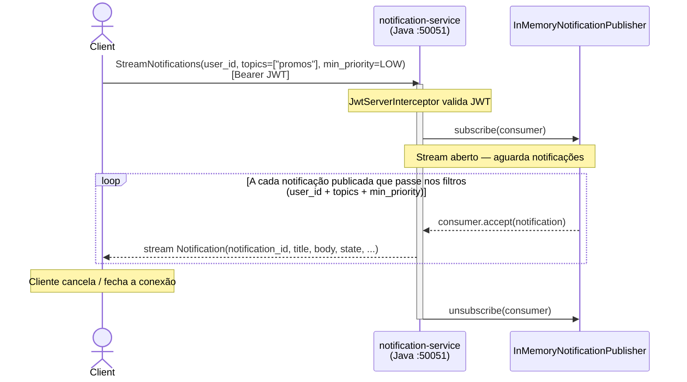
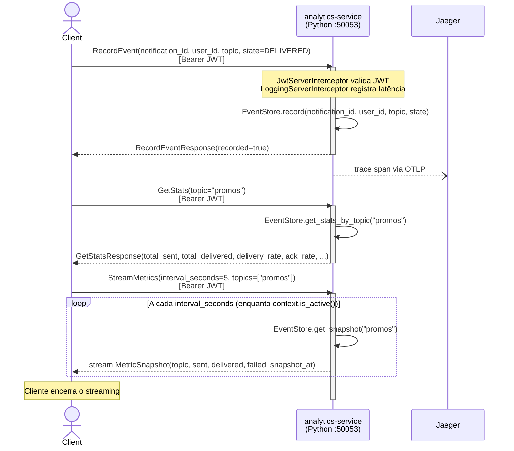

# PoC gRPC — Plataforma de Notificações Distribuída

PoC demonstrando boas práticas de gRPC em três serviços independentes com linguagens diferentes, comunicando-se via contratos Protobuf compartilhados.

---

## Cenário

Uma plataforma de notificações onde cada serviço tem responsabilidade própria:

| Serviço | Linguagem | Porta gRPC | Porta HTTP/Métricas |
|---|---|---|---|
| `notification-service` | Java 21 + Spring Boot 3 | 50051 | 8080 (Actuator) |
| `subscription-service` | Kotlin + gRPC-Kotlin | 50052 | 8081 (Ktor) |
| `analytics-service` | Python 3.12 + grpcio | 50053 | 9091 (Prometheus) |
| Jaeger (tracing UI) | — | 4317 (OTLP) | 16686 |
| Prometheus | — | — | 9090 |

---

## Estrutura

```
poc-grpc/
├── proto/                          # Contratos Protobuf compartilhados → README
│   ├── buf.yaml                    # Lint + breaking change detection
│   ├── buf.gen.yaml                # Geração de código multi-linguagem
│   ├── notification/v1/notification.proto
│   ├── subscription/v1/subscription.proto
│   └── analytics/v1/analytics.proto
│
├── notification-service/           # Java 21 / Spring Boot 3 / Hexagonal → README
│   ├── src/
│   │   ├── main/java/…
│   │   │   ├── domain/             # Entidades, ports, value objects
│   │   │   ├── application/        # Use cases, DTOs
│   │   │   ├── adapter/grpc/       # gRPC adapter + proto mapper
│   │   │   └── infrastructure/     # Persistência, pub/sub, interceptors
│   │   └── test/java/…             # JUnit 5 + Mockito (7 classes)
│   ├── checkstyle.xml
│   └── pom.xml                     # JaCoCo ≥90% + Checkstyle
│
├── subscription-service/           # Kotlin + gRPC-Kotlin coroutines → README
│   ├── src/
│   │   ├── main/kotlin/…
│   │   │   ├── config/             # AppConfig (env vars)
│   │   │   ├── grpc/               # Server, SubscriptionServiceImpl
│   │   │   ├── http/               # Ktor health endpoint
│   │   │   └── interceptor/        # JWT + Logging client interceptors
│   │   └── test/kotlin/…           # JUnit 5 + MockK (3 classes)
│   └── build.gradle.kts            # Kover ≥90% + ktlint
│
├── analytics-service/              # Python 3.12 + grpcio → README
│   ├── src/
│   │   ├── main.py                 # Entrypoint
│   │   ├── analytics_service.py    # Implementação gRPC + EventStore
│   │   ├── interceptors.py         # JWT + Logging server interceptors
│   │   └── otel_setup.py           # OpenTelemetry SDK
│   ├── tests/                      # pytest + pytest-cov (3 módulos)
│   ├── scripts/generate_proto.sh   # Gera stubs Python localmente
│   ├── pyproject.toml              # pytest-cov ≥90% + ruff
│   └── requirements.txt
│
├── infra/                          # Docker Compose + Prometheus → README
│   ├── docker-compose.yml
│   └── prometheus.yml
│
└── Makefile                        # Orquestra test + lint das 3 linguagens
```

---

## Arquitetura

### C4 — Nível 1: Contexto do Sistema



---

### C4 — Nível 2: Containers



---

### Fluxo 1 — Envio direto de notificação (unary)



---

### Fluxo 2 — Inscrição e publicação com fan-out (subscription → notification)



---

### Fluxo 3 — Streaming de notificações em tempo real (server streaming)



---

### Fluxo 4 — Ingestão e consulta de analytics



---

## Documentação por diretório

| Diretório | README | Conteúdo |
|---|---|---|
| `proto/` | [proto/README.md](proto/README.md) | buf lint/breaking, `buf generate`, convenções de nomenclatura |
| `notification-service/` | [notification-service/README.md](notification-service/README.md) | Maven, JaCoCo, Checkstyle, exemplos gRPC |
| `subscription-service/` | [subscription-service/README.md](subscription-service/README.md) | Gradle, Kover, ktlint, exemplos gRPC |
| `analytics-service/` | [analytics-service/README.md](analytics-service/README.md) | pip, geração de stubs, pytest-cov, ruff, exemplos gRPC |
| `infra/` | [infra/README.md](infra/README.md) | Docker Compose, topologia de rede, Jaeger, Prometheus |

---

## Pré-requisitos

- Docker 24+ e Docker Compose v2
- Para desenvolvimento local:
  - Java 21+, Maven 3.9+
  - Kotlin / Gradle 8.8+
  - Python 3.12+, pip
  - [`buf`](https://buf.build/docs/installation) v2 (lint / breaking check)

---

## Execução com Docker Compose

```bash
cd infra
docker compose up --build
```

Serviços disponíveis após o start:

| URL | Descrição |
|---|---|
| `localhost:50051` | notification-service gRPC |
| `localhost:50052` | subscription-service gRPC |
| `localhost:50053` | analytics-service gRPC |
| http://localhost:16686 | Jaeger UI — traces distribuídos |
| http://localhost:9090 | Prometheus — métricas |
| http://localhost:8080/actuator/health | notification-service health |

---

## Teste rápido com grpcurl

```bash
# Instalar: brew install grpcurl

# 1. Gerar um JWT de teste (Python one-liner)
TOKEN=$(python3 -c "
import jwt, datetime
secret='poc-grpc-super-secret-key-change-in-production'
payload={'sub':'test-user','exp': datetime.datetime.utcnow()+datetime.timedelta(hours=1)}
print(jwt.encode(payload, secret, algorithm='HS256'))
")

# 2. Inscrever um usuário no subscription-service
grpcurl -plaintext \
  -H "authorization: Bearer $TOKEN" \
  -d '{"user_id":"user-001","topic":"promos","min_priority":"NOTIFICATION_PRIORITY_NORMAL"}' \
  localhost:50052 subscription.v1.SubscriptionService/Subscribe

# 3. Enviar uma notificação pelo notification-service (unary)
grpcurl -plaintext \
  -H "authorization: Bearer $TOKEN" \
  -d '{"user_id":"user-001","topic":"promos","title":"Oferta!","body":"50% de desconto hoje","priority":"NOTIFICATION_PRIORITY_HIGH"}' \
  localhost:50051 notification.v1.NotificationService/SendNotification

# 4. Publicar para todos os inscritos pelo subscription-service
grpcurl -plaintext \
  -H "authorization: Bearer $TOKEN" \
  -d '{"topic":"promos","title":"Flash Sale","body":"Apenas hoje!","priority":"NOTIFICATION_PRIORITY_CRITICAL"}' \
  localhost:50052 subscription.v1.SubscriptionService/PublishToSubscribers

# 5. Registrar evento no analytics-service
grpcurl -plaintext \
  -H "authorization: Bearer $TOKEN" \
  -d '{"notification_id":"n-001","user_id":"user-001","topic":"promos","state":"NOTIFICATION_STATE_DELIVERED"}' \
  localhost:50053 analytics.v1.AnalyticsService/RecordEvent

# 6. Consultar stats
grpcurl -plaintext \
  -H "authorization: Bearer $TOKEN" \
  -d '{"topic":"promos"}' \
  localhost:50053 analytics.v1.AnalyticsService/GetStats

# 7. Server streaming de notificações em tempo real
grpcurl -plaintext \
  -H "authorization: Bearer $TOKEN" \
  -d '{"user_id":"user-001","topics":["promos"],"min_priority":"NOTIFICATION_PRIORITY_LOW"}' \
  localhost:50051 notification.v1.NotificationService/StreamNotifications
```

---

## Testes e Lint

Cada serviço tem cobertura ≥ 90% e lint configurado. Use o `Makefile` na raiz para orquestrar:

```bash
# Rodar tudo (testes + cobertura)
make test-all

# Somente lint
make lint

# Por linguagem
make test-java     # mvn verify (JaCoCo + Checkstyle)
make test-kotlin   # ./gradlew koverVerify + ktlintCheck
make test-python   # pytest --cov-fail-under=90 + ruff check
```

| Serviço | Ferramenta de teste | Cobertura | Lint |
|---|---|---|---|
| `notification-service` | JUnit 5 + Mockito + AssertJ | JaCoCo ≥ 90% instrução | Checkstyle (Google Style) |
| `subscription-service` | JUnit 5 + MockK + AssertJ | Kover ≥ 90% linha | ktlint 1.2.1 |
| `analytics-service` | pytest + pytest-cov | ≥ 90% | ruff (E, W, F, I) |

---

## Boas Práticas Demonstradas

### 1. Proto Design + Versionamento com buf

- **`proto/buf.yaml`** — lint com ruleset `BASIC + DEFAULT`, breaking change detection por arquivo
- Naming: `snake_case` para campos, `PascalCase` para messages/services/enums
- Uso de `google.protobuf.Timestamp`, `google.rpc.Status`, `google.rpc.ErrorInfo`
- Versionamento explícito nos packages: `notification.v1`, `subscription.v1`, `analytics.v1`

```bash
# Validar lint
cd proto && buf lint

# Verificar breaking changes em relação à branch main
buf breaking --against '.git#branch=main'
```

### 2. Interceptors, Auth e TLS

| Serviço | Implementação |
|---|---|
| **Java** | `JwtServerInterceptor` — valida Bearer JWT no metadata `authorization`, propaga `userId` via `Context` |
| **Java** | `LoggingServerInterceptor` — MDC com `grpc.method`, `grpc.status`, `grpc.latency_ms` |
| **Kotlin** | `JwtClientInterceptor` — injeta JWT em todas as chamadas ao notification-service |
| **Kotlin** | `LoggingClientInterceptor` — loga latência e status de chamadas de saída |
| **Python** | `JwtServerInterceptor` + `LoggingServerInterceptor` — mesmas práticas via `grpc.ServerInterceptor` |

### 3. Deadlines, Retry e Erros

- **`SubscriptionServiceImpl.publishToSubscribers`** — usa `withTimeout(5_000)` por chamada downstream, isolando falhas por usuário sem cancelar o batch inteiro
- Status codes corretos: `INVALID_ARGUMENT`, `NOT_FOUND`, `UNAUTHENTICATED`
- **Java** — usa `Status.INVALID_ARGUMENT.withDescription(...)` mapeado para `StatusException` no cliente
- **Python** — `context.abort(grpc.StatusCode.X, "mensagem")` com verificação explícita de `is_active()` no streaming

### 4. Observabilidade

| Pilar | Java | Kotlin | Python |
|---|---|---|---|
| **Tracing** | Micrometer + OTel bridge → Jaeger | OTel SDK → Jaeger | OTel SDK → Jaeger |
| **Métricas** | Micrometer/Prometheus via Actuator | Micrometer | `prometheus_client` |
| **Logging** | SLF4J + Logback + MDC estruturado | Logback + structlog pattern | `structlog` JSON |

Abrir **http://localhost:16686** após um fluxo completo para ver os traces distribuídos entre os serviços.

---

## Geração local de stubs Python

```bash
cd analytics-service && bash scripts/generate_proto.sh
```

> Detalhes em [analytics-service/README.md](analytics-service/README.md).

---

## Lint e Breaking Changes (buf)

```bash
cd proto
buf lint
buf breaking --against '.git#branch=main'
```

> Detalhes de convenções e geração de código em [proto/README.md](proto/README.md).
