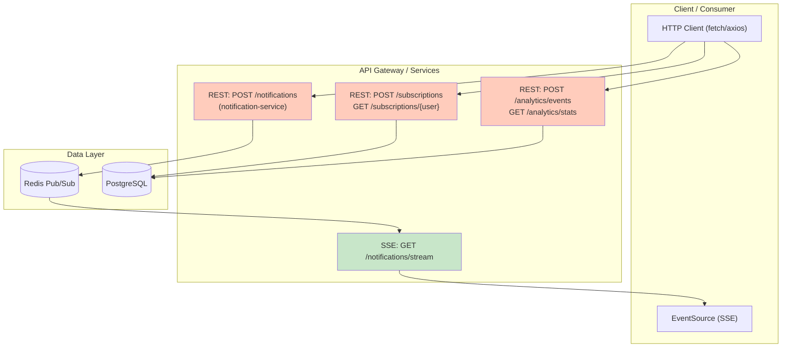
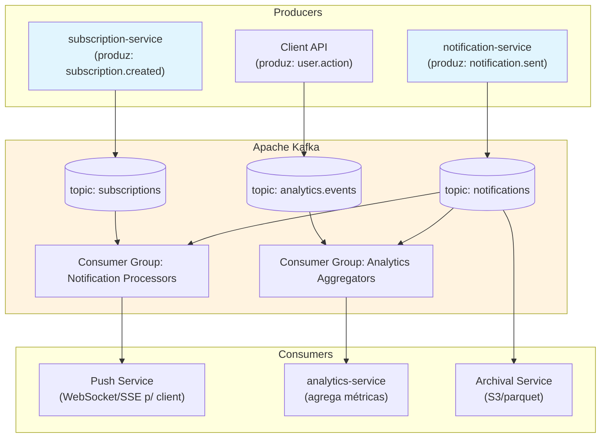
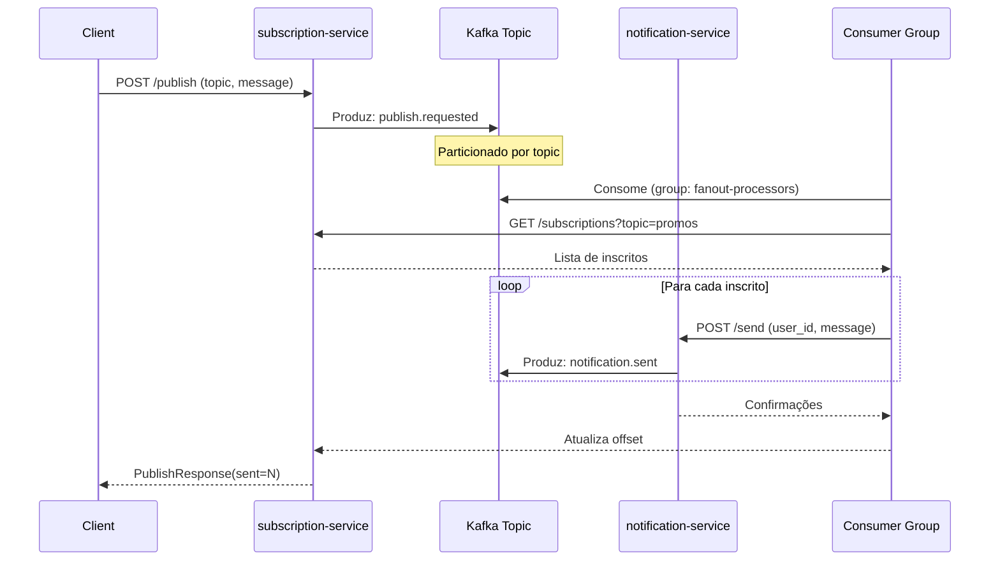
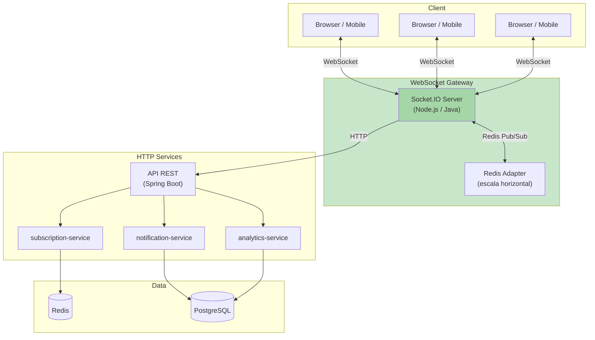
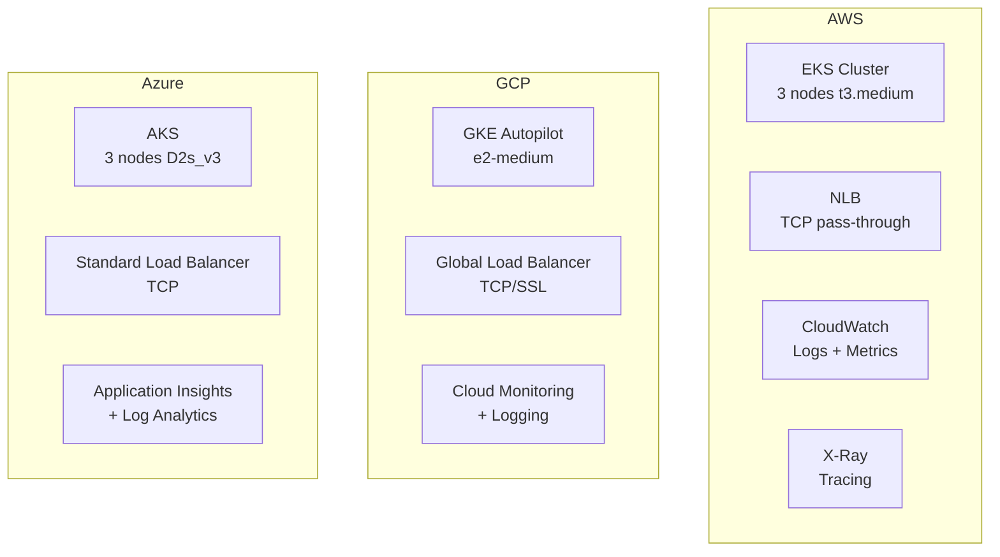
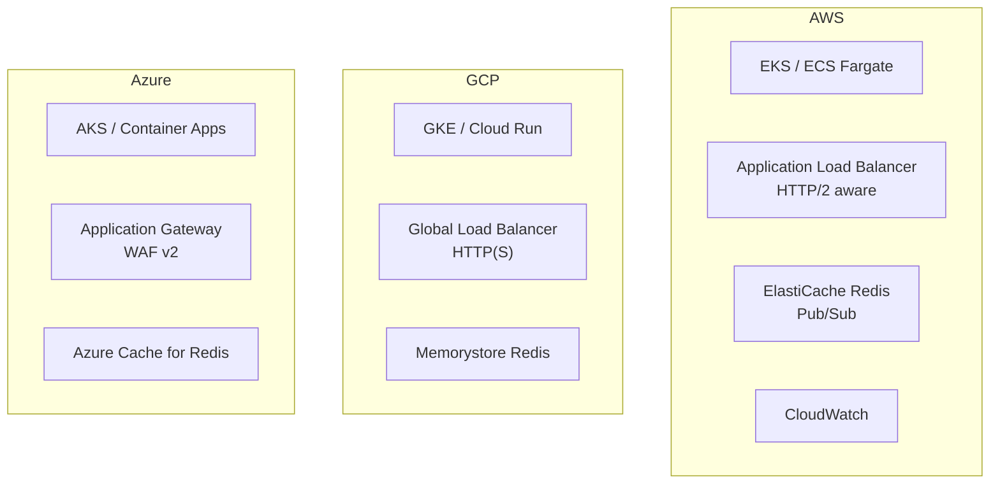
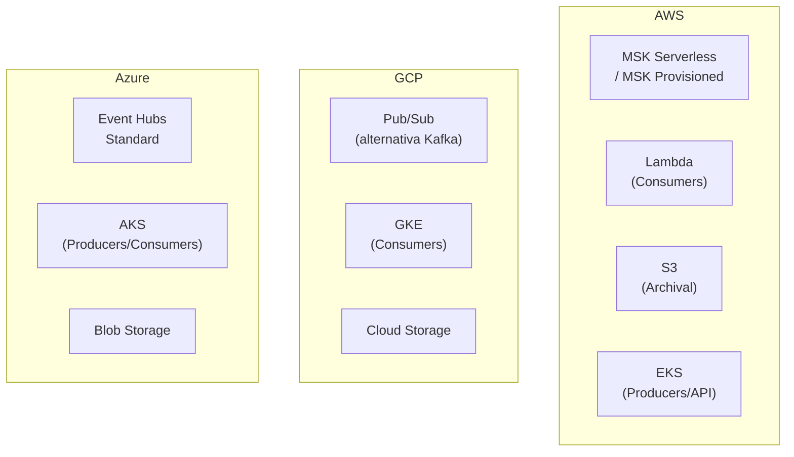
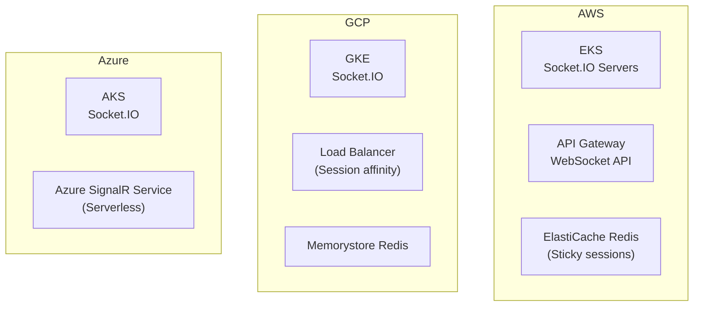
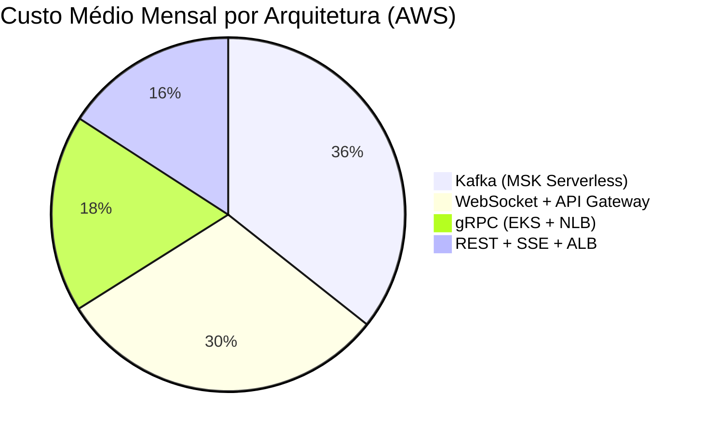

# Alternativas ao gRPC: Arquiteturas para o Sistema de Notificações

Análise de arquiteturas alternativas que poderiam substituir o gRPC neste sistema de notificações, mantendo os mesmos requisitos funcionais: streaming em tempo real, fan-out de notificações, autenticação JWT e observabilidade.

---

## 1. Visão Geral das Alternativas

| Alternativa | Tecnologias | Complexidade | Performance | Melhor para |
|---|---|---|---|---|
| **REST + SSE** | HTTP/2, JSON, Server-Sent Events | ⭐⭐⭐ Média | ⭐⭐⭐ Boa | Universidade, debugging fácil |
| **Message Queue** | Kafka, RabbitMQ, NATS | ⭐⭐⭐⭐ Alta | ⭐⭐⭐⭐⭐ Excelente | Escalabilidade massiva, desacoplamento |
| **WebSocket Centralizado** | Socket.IO, ws | ⭐⭐⭐ Média | ⭐⭐⭐⭐ Muito boa | Real-time bidirecional |
| **Event-Driven (EDA)** | Kafka + REST + WebSocket | ⭐⭐⭐⭐⭐ Alta | ⭐⭐⭐⭐⭐ Excelente | Sistemas complexos, resiliência |
| **tRPC** | TypeScript, monorepo | ⭐⭐⭐ Média | ⭐⭐⭐⭐ Muito boa | Full-stack TypeScript |
| **GraphQL Subscriptions** | Apollo, WebSocket | ⭐⭐⭐⭐ Alta | ⭐⭐⭐ Boa | Queries flexíveis |

---

## 2. Arquitetura 1: REST + Server-Sent Events (SSE)

### 2.1 Diagrama



### 2.2 Implementação por Serviço

**notification-service (Java/Spring Boot):**
```java
@RestController
public class NotificationController {
    
    @PostMapping("/notifications")
    public ResponseEntity<NotificationResponse> send(@RequestBody NotificationRequest req) {
        // Publica no Redis Pub/Sub
        redisTemplate.convertAndSend("notifications:" + req.userId(), req);
        return ResponseEntity.ok(new NotificationResponse(id, Instant.now()));
    }
    
    @GetMapping(value = "/notifications/stream", produces = MediaType.TEXT_EVENT_STREAM_VALUE)
    public SseEmitter stream(@RequestParam String userId) {
        SseEmitter emitter = new SseEmitter();
        redisMessageListener.addMessageListener(message -> {
            emitter.send(message);
        }, new PatternTopic("notifications:" + userId));
        return emitter;
    }
}
```

**subscription-service (Kotlin/Spring Boot):**
```kotlin
@RestController
class SubscriptionController(
    private val subscriptionRepository: SubscriptionRepository,
    private val restTemplate: RestTemplate
) {
    
    @PostMapping("/subscriptions")
    fun subscribe(@RequestBody req: SubscribeRequest): SubscribeResponse {
        return subscriptionRepository.save(req.toEntity()).toResponse()
    }
    
    @PostMapping("/publish")
    fun publish(@RequestBody req: PublishRequest): PublishResponse {
        val subscribers = subscriptionRepository.findByTopic(req.topic)
        val results = subscribers.map { subscriber ->
            restTemplate.postForEntity(
                "http://notification-service/notifications",
                req.toNotificationRequest(subscriber.userId),
                NotificationResponse::class.java
            )
        }
        return PublishResponse(sent = results.count { it.statusCode.is2xxSuccessful })
    }
}
```

### 2.3 Prós e Contras

| ✅ Prós | ❌ Contras |
|---|---|
| Debugging com `curl` e browser DevTools | Sem streaming bidirecional (apenas server→client) |
| Caching HTTP nativo (Cache-Control, ETag) | Overhead JSON (5-10x maior que Protobuf) |
| Load balancers L7 funcionam perfeitamente | Deadlines/timeouts menos precisos |
| Autenticação JWT padrão (header Authorization) | Fan-out requer N chamadas HTTP (vs 1 RPC streaming) |
| Sem necessidade de proto/geração | Reconexão SSE manual (não built-in) |

---

## 3. Arquitetura 2: Event-Driven com Apache Kafka

### 3.1 Diagrama



### 3.2 Fluxo: Fan-out com Kafka



### 3.3 Prós e Contras

| ✅ Prós | ❌ Contras |
|---|---|
| Desacoplamento total entre serviços | Complexidade operacional (Kafka cluster) |
| Replay de eventos (time travel) | Latência maior (ms vs μs) |
| Escalabilidade horizontal massiva | Sem type safety nativo (schema registry ajuda) |
| Backpressure automática (consumer lag) | Debugging distribuído mais difícil |
| Persistência de eventos (audit trail) | Requer schema evolution (Avro/Protobuf) |

---

## 4. Arquitetura 3: WebSocket Centralizado (Socket.IO)

### 4.1 Diagrama



### 4.2 Eventos Socket.IO

```javascript
// Cliente (browser)
const socket = io('wss://api.example.com');

// Autenticação
socket.emit('auth', { token: 'jwt-token' });

// Inscrição em tópico
socket.emit('subscribe', { topic: 'promos', minPriority: 'NORMAL' });

// Receber notificações
socket.on('notification', (data) => {
    console.log('Notificação:', data);
});

// Publicar
socket.emit('publish', {
    topic: 'promos',
    title: 'Oferta!',
    body: '50% OFF'
});
```

```java
// Server (Spring Boot + Socket.IO)
@OnEvent("publish")
public void onPublish(SocketIOClient client, PublishData data) {
    // Valida JWT
    String userId = jwtService.validate(client.getHandshakeData().getHttpHeaders());
    
    // Busca inscritos
    List<String> subscribers = subscriptionService.findByTopic(data.getTopic());
    
    // Emite para cada inscrito conectado
    subscribers.forEach(sub -> {
        socketNamespace.getRoomOperations("user:" + sub)
            .sendEvent("notification", data.toNotification());
    });
}
```

### 4.3 Prós e Contras

| ✅ Prós | ❌ Contras |
|---|---|
| Full-duplex real (cliente pode enviar a qualquer momento) | Estado na conexão (sticky sessions necessárias) |
| Broadcast eficiente para múltiplos clients | Não funciona bem com serverless (WebSocket persistente) |
| Reconexão automática (Socket.IO) | Sem type safety (JSON schema manual) |
| Excelente para browsers | Acoplamento maior (serviço de gateway) |
| Fallback para HTTP long-polling | Escalar WebSocket é mais complexo que HTTP |

---

## 5. Arquitetura 4: tRPC (TypeScript Monorepo)

> **Nota:** tRPC é específico para TypeScript. Para poliglotia Java/Kotlin/Python, esta alternativa seria inviável sem mudar todas as stacks.

### 5.1 Conceito (se fosse TypeScript-only)

```typescript
// Definição de procedures (server)
const appRouter = router({
  notification: {
    send: publicProcedure
      .input(z.object({ userId: z.string(), title: z.string() }))
      .mutation(({ input }) => {
        return { notificationId: uuid(), acceptedAt: new Date() };
      }),
    
    stream: publicProcedure
      .input(z.object({ userId: z.string() }))
      .subscription(({ input }) => {
        return observable((emit) => {
          const interval = setInterval(() => {
            emit.next({ notification: getLatest(input.userId) });
          }, 1000);
          return () => clearInterval(interval);
        });
      }),
  },
  
  subscription: {
    create: publicProcedure
      .input(z.object({ userId: z.string(), topic: z.string() }))
      .mutation(({ input }) => subscriptionService.create(input)),
    
    publishToSubscribers: publicProcedure
      .input(z.object({ topic: z.string(), message: z.string() }))
      .mutation(async ({ input }) => {
        const subs = await subscriptionService.findByTopic(input.topic);
        return Promise.all(subs.map(sub => 
          notificationService.send(sub.userId, input.message)
        ));
      }),
  },
});

// Cliente com autocomplete 100%
const client = createTRPCProxyClient<AppRouter>({ links: [httpBatchLink({ url })] });

// TypeScript sabe exatamente os tipos
const result = await client.notification.send({ userId: '123', title: 'Test' });
// result: { notificationId: string, acceptedAt: Date }
```

### 5.2 Prós e Contras

| ✅ Prós | ❌ Contras |
|---|---|
| Type safety end-to-end (TypeScript) | ❌ Não funciona com Java/Kotlin/Python |
| Zero código boilerplate | Requer monorepo TypeScript |
| Autocomplete no IDE | Menos maduro que gRPC para produção |
| Streaming com subscriptions | Performance inferior a gRPC |

---

## 6. Comparação Detalhada das Alternativas

### 6.1 Para o Requisito: "Streaming de Notificações"

| Alternativa | Implementação | Latência | Escalabilidade |
|---|---|---|---|
| **gRPC (atual)** | `StreamNotifications` RPC | ~2-5ms | ⭐⭐⭐⭐⭐ Horizontal |
| **REST + SSE** | `SseEmitter` + Redis Pub/Sub | ~10-50ms | ⭐⭐⭐⭐ Stateful connections |
| **Kafka** | Consumer contínuo | ~50-200ms | ⭐⭐⭐⭐⭐ Massiva |
| **WebSocket** | Socket.IO room | ~5-20ms | ⭐⭐⭐ Sticky sessions |
| **GraphQL** | Subscription + WebSocket | ~10-50ms | ⭐⭐⭐⭐ Similar SSE |

### 6.2 Para o Requisito: "Fan-out de Notificações"

| Alternativa | Mecanismo | Confiabilidade | Complexidade |
|---|---|---|---|
| **gRPC** | Loop RPC com timeout | ⭐⭐⭐⭐ Alta | ⭐⭐⭐ Média |
| **REST** | N chamadas HTTP | ⭐⭐⭐ Média | ⭐⭐ Simples |
| **Kafka** | Consumer group processa | ⭐⭐⭐⭐⭐ Muito alta | ⭐⭐⭐⭐ Alta |
| **WebSocket** | Room broadcast | ⭐⭐⭐ Média | ⭐⭐⭐ Média |

### 6.3 Para o Requisito: "Observabilidade"

| Alternativa | Tracing | Métricas | Logging |
|---|---|---|---|
| **gRPC** | Metadata nativa, gRPC context | Status codes granulares | Interceptors |
| **REST** | Headers HTTP padrão | Status codes HTTP | Middleware |
| **Kafka** | Headers de mensagem | Consumer lag, throughput | Structured logs |
| **WebSocket** | Session ID tracking | Conexões ativas, mensagens/s | Event-based |

---

## 7. Análise de Custos em Cloud (AWS, GCP, Azure)

Estimativa de custos mensais para um sistema processando **10 milhões de notificações/dia** (~116 msg/s, picos de 1.000 msg/s), com 3 serviços em 3 AZs, média de 500 conexões simultâneas.

### 7.1 gRPC (Arquitetura Atual)



| Provedor | Serviços | Custo Mensal Estimado |
|---|---|---|
| **AWS** | EKS ($75) + 3× t3.medium ($180) + NLB ($22) + CloudWatch/X-Ray ($50) | **~$327/mês** |
| **GCP** | GKE Autopilot (~$200) + TCP Load Balancer ($18) + Cloud Monitoring ($40) | **~$258/mês** |
| **Azure** | AKS (gratuito) + 3× D2s_v3 ($210) + Load Balancer ($25) + App Insights ($45) | **~$280/mês** |

**Notas gRPC:**
- NLB/ALB TCP pass-through (não inspeciona HTTP/2)
- Menor custo de data transfer (payload binário menor)
- Sem API Gateway (conexão direta)

---

### 7.2 REST + SSE



| Provedor | Serviços | Custo Mensal Estimado |
|---|---|---|
| **AWS** | ECS Fargate ($150) + ALB LCU ($45) + ElastiCache cache.t3.micro ($12) + Data Transfer ($80) | **~$287/mês** |
| **GCP** | Cloud Run ($120) + HTTP Load Balancer ($35) + Memorystore ($15) + Data Transfer ($70) | **~$240/mês** |
| **Azure** | Container Apps ($140) + App Gateway WAF ($145) + Redis ($16) + Data Transfer ($75) | **~$376/mês** |

**Diferenças de Custo REST:**
- Maior data transfer (JSON 5-10× maior que Protobuf)
- ALB mais caro que NLB (inspeção HTTP)
- Redis necessário para Pub/Sub SSE

---

### 7.3 Kafka (Event-Driven)



| Provedor | Serviços | Custo Mensal Estimado |
|---|---|---|
| **AWS** | MSK Serverless (~$200) ou MSK 3×kafka.m5.large (~$450) + Lambda ($40) + S3 ($5) + EKS ($150) | **~$395-645/mês** |
| **GCP** | Pub/Sub ($180 para 10M msg/dia) + GKE ($120) + GCS ($5) | **~$305/mês** |
| **Azure** | Event Hubs Standard ($20/unidade) × 2 = $40 + AKS ($150) + Blob ($5) | **~$195/mês** |

**Notas Kafka:**
- Kafka é o maior custo operacional
- AWS MSK Serverless simplifica mas é caro
- GCP Pub/Sub é mais barato que Kafka gerenciado
- Azure Event Hubs é o mais econômico para Kafka-like

---

### 7.4 WebSocket Centralizado



| Provedor | Serviços | Custo Mensal Estimado |
|---|---|---|
| **AWS** | EKS ($200) + API Gateway WebSocket ($10/1M conexões = ~$300) + ElastiCache ($50) | **~$550/mês** |
| **GCP** | GKE ($180) + Load Balancer ($45 sticky) + Memorystore ($50) | **~$275/mês** |
| **Azure** | AKS ($150) + SignalR Service ($50/500 conexões) + Redis ($20) | **~$220/mês** |

**Notas WebSocket:**
- AWS API Gateway WebSocket é caro para conexões persistentes
- Azure SignalR Service é o mais econômico
- Sticky sessions aumentam custo de load balancer

---

### 7.5 Resumo Comparativo de Custos



| Arquitetura | AWS | GCP | Azure | Ranking Custo |
|---|---|---|---|---|
| **gRPC** | ~$327 | ~$258 | ~$280 | ⭐⭐⭐⭐ Econômica |
| **REST + SSE** | ~$287 | ~$240 | ~$376 | ⭐⭐⭐⭐ GCP é barato; Azure é caro |
| **Kafka** | ~$395-645 | ~$305 | ~$195 | ⭐⭐⭐ AWS caro; Azure mais barato |
| **WebSocket** | ~$550 | ~$275 | ~$220 | ⭐⭐⭐ AWS caro; Azure mais barato |

---

### 7.6 Fatores que Afetam Custo

| Fator | Impacto |
|---|---|
| **Data Transfer** | REST pode custar 3-5× mais que gRPC (JSON maior) |
| **Load Balancer** | NLB (gRPC) é ~50% mais barato que ALB (REST) |
| **Conexões Persistentes** | WebSocket API Gateway cobra por minuto de conexão |
| **Storage de Eventos** | Kafka requer storage persistente (EBS/GP3) |
| **Managed vs Self-hosted** | Kafka gerenciado é 2-3× mais caro que self-hosted |

---

### 7.7 Recomendações de Custo

**Para startups/custos mínimos:**
→ **GCP + REST + Cloud Run**
- Cloud Run: scale-to-zero, paga só por uso
- ~$50-100/mês para 10M notificações/dia

**Para enterprise/AWS existing:**
→ **gRPC + EKS + NLB**
- Melhor performance por dólar
- ~$327/mês com capacidade de sobra

**Para escala massiva (1B+ notificações):**
→ **Azure + Event Hubs + WebSocket**
- Event Hubs é mais barato que Kafka/Kinesis
- ~$500/mês para escala massiva

---

## 8. Recomendações por Contexto (Técnicas + Custo)

### 8.1 Se o time quer simplicidade máxima + custo baixo
→ **GCP + REST + SSE + Cloud Run**
- Menor curva de aprendizado
- Debugging com ferramentas universais
- Cloud Run scale-to-zero: ~$50-100/mês

### 8.2 Se precisa de escala massiva (>1M notificações/segundo)
→ **Azure + Kafka + Event Hubs**
- Event sourcing completo
- Event Hubs é mais barato que AWS MSK
- ~$195-305/mês vs $395-645/mês na AWS

### 8.3 Se o foco é browser/mobile real-time
→ **Azure + SignalR + WebSocket**
- SignalR Service gerenciado é mais barato que API Gateway
- ~$220/mês vs ~$550/mês na AWS
- Fallback automático para SSE/long-polling

### 8.4 Se quer manter type safety + custo controlado
→ **gRPC + GCP + GKE Autopilot**
- Type safety nativo
- GKE Autopilot é mais barato que EKS/AKS
- ~$258/mês com NLB TCP (sem ALB caro)

---

## 9. Conclusão

Não há substituto perfeito para gRPC nesta arquitetura específica. Cada alternativa envolve **trade-offs significativos**:

| Se você escolher... | Você ganha... | Mas perde... | Custo AWS/GCP/Azure |
|---|---|---|---|
| **REST + SSE** | Simplicidade, debug fácil | Performance, type safety | $240-376/mês |
| **Kafka** | Escala, resiliência | Latência, complexidade | $195-645/mês |
| **WebSocket** | UX real-time, bidirecional | Escalabilidade, acoplamento | $220-550/mês |
| **gRPC (atual)** | Performance, type safety | Curva de aprendizado | $258-327/mês |

**Recomendação final técnica:** Para um sistema poliglota (Java/Kotlin/Python) com requisitos de performance e streaming, **gRPC continua sendo a melhor escolha**. As alternativas só fazem sentido se:
1. O time não tem expertise em gRPC/Protobuf → REST
2. O sistema precisa de desacoplamento total → Kafka
3. A UX browser é prioridade #1 → WebSocket
4. Debugging e simplicidade superam performance → REST

**Recomendação final de custo:**
- **Orçamento mínimo**: GCP + REST + Cloud Run (~$50-100/mês)
- **Melhor custo/benefício**: GCP + gRPC + GKE Autopilot (~$258/mês)
- **Escala massiva**: Azure + Event Hubs (~$195/mês)
- **Evitar**: AWS API Gateway WebSocket (~$550/mês caro)

Este POC demonstra gRPC em sua "sweet spot" — removê-lo exigiria mudanças arquiteturais significativas, perda de capacidades **ou aumento de custos operacionais**.
