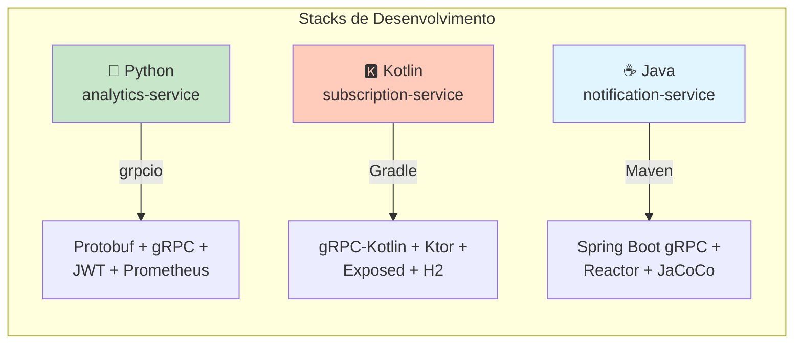

# Guia de Desenvolvimento

Guia completo para desenvolvimento local dos três serviços: Python (analytics), Kotlin (subscription) e Java (notification).

---

## 1. Visão Geral por Stack



| Serviço | Linguagem | Build Tool | Portas | Profile |
|---|---|---|---|---|
| **analytics-service** | Python 3.12 | pip + venv | 50053 (gRPC), 9091 (Prometheus) | - |
| **subscription-service** | Kotlin 1.9 | Gradle 8 | 50052 (gRPC), 8081 (HTTP health) | jvm21 |
| **notification-service** | Java 21 | Maven 3.9 | 50051 (gRPC), 8080 (HTTP/mgmt) | - |

---

## 2. Pré-requisitos Comuns

```bash
# Todas as stacks
docker --version          # 24.0+
docker compose version    # 2.0+

# Java/Kotlin
java --version           # OpenJDK 21
# Maven incluído via wrapper: ./mvnw
# Gradle incluído via wrapper: ./gradlew

# Python
python3 --version        # 3.12
pip --version            # 24.0+
```

---

## 3. analytics-service (Python)

### 3.1 Estrutura de Diretórios

```
analytics-service/
├── src/
│   ├── __init__.py
│   ├── main.py                 # Entry point (gRPC server + Prometheus)
│   ├── analytics_service.py    # Implementação do serviço
│   ├── interceptors.py         # JWT + Logging interceptors
│   └── metrics.py              # Métricas Prometheus
├── tests/
│   ├── conftest.py             # Fixtures de teste
│   ├── test_analytics_service.py
│   ├── test_event_store.py
│   └── test_interceptors.py
├── generated/                  # Stubs gRPC (gerado automaticamente)
│   ├── analytics_pb2.py
│   ├── analytics_pb2_grpc.py
│   ├── notification_pb2.py
│   └── notification_pb2_grpc.py
├── scripts/
│   └── generate_proto.sh       # Script de geração de stubs
├── requirements.txt            # Dependências
├── requirements-dev.txt        # Dependências de desenvolvimento
└── Dockerfile
```

### 3.2 Dependências Principais

| Categoria | Biblioteca | Versão | Propósito |
|---|---|---|---|
| **gRPC** | `grpcio` | >=1.63.0 | Server e client gRPC |
| **gRPC** | `grpcio-tools` | >=1.63.0 | Protoc compiler |
| **Segurança** | `PyJWT` | >=2.8.0 | Validação de tokens JWT |
| **Métricas** | `prometheus-client` | >=0.20.0 | Métricas expostas |
| **Testes** | `pytest` | >=8.2.0 | Framework de testes |
| **Lint** | `ruff` | >=0.4.0 | Linter e formatter |
| **Coverage** | `pytest-cov` | >=5.0.0 | Cobertura de testes |

### 3.3 Como Rodar Localmente

```bash
# 1. Navegar ao diretório
cd analytics-service

# 2. Criar virtual environment
python3 -m venv venv

# 3. Ativar
source venv/bin/activate        # macOS/Linux
# ou: venv\Scripts\activate   # Windows

# 4. Instalar dependências
pip install -r requirements.txt
pip install -r requirements-dev.txt

# 5. Gerar stubs gRPC (se necessário)
bash scripts/generate_proto.sh

# 6. Rodar o serviço
python -m src.main

# Saída esperada:
# INFO:__main__:Analytics gRPC server starting on port 50053
# INFO:__main__:Prometheus metrics on port 9091
```

### 3.4 Variáveis de Ambiente

```bash
export GRPC_PORT=50053
export PROMETHEUS_PORT=9091
export JWT_SECRET="poc-grpc-super-secret-key-change-in-production"
export OTEL_EXPORTER_OTLP_ENDPOINT="http://localhost:4317"
```

### 3.5 Como Rodar Testes

```bash
# Testes com cobertura
pytest tests/ -v --cov=src --cov-report=term-missing

# Testes específicos
pytest tests/test_analytics_service.py -v

# Testes com debug
pytest tests/test_interceptors.py -v -s
```

### 3.6 Lint e Formatação

```bash
# Checar lint
ruff check src/ tests/

# Auto-formatar
ruff format src/ tests/

# Fix automático
ruff check --fix src/ tests/
```

### 3.7 Hot Reload para Desenvolvimento

```bash
# Usando watchdog
pip install watchdog

# Script simples de hot reload
watchmedo auto-restart --directory=src --pattern="*.py" --recursive -- python -m src.main
```

---

## 4. subscription-service (Kotlin)

### 4.1 Estrutura de Diretórios

```
subscription-service/
├── src/
│   ├── main/
│   │   ├── kotlin/br/com/poc/grpc/subscription/
│   │   │   ├── Main.kt               # Entry point
│   │   │   ├── config/
│   │   │   │   └── AppConfig.kt      # Configurações
│   │   │   ├── grpc/
│   │   │   │   └── SubscriptionServiceImpl.kt
│   │   │   ├── interceptor/
│   │   │   │   ├── JwtClientInterceptor.kt
│   │   │   │   └── LoggingClientInterceptor.kt
│   │   │   └── http/
│   │   │       └── HealthServer.kt   # HTTP health check
│   │   └── resources/
│   │       └── logback.xml           # Logging config
│   └── test/
│       └── kotlin/br/com/poc/grpc/subscription/
│           ├── grpc/
│           │   └── SubscriptionServiceImplTest.kt
│           ├── interceptor/
│           │   ├── JwtClientInterceptorTest.kt
│           │   └── LoggingClientInterceptorTest.kt
│           └── ...
├── build.gradle.kts              # Configuração Gradle
├── gradle/
│   └── wrapper/
├── settings.gradle.kts
├── gradlew                       # Wrapper (não precisa instalar Gradle)
└── Dockerfile
```

### 4.2 Dependências Principais

| Categoria | Biblioteca | Versão | Propósito |
|---|---|---|---|
| **gRPC** | `grpc-kotlin-stub` | 1.4.1 | Stubs Kotlin para gRPC |
| **gRPC** | `grpc-netty-shaded` | 1.64.0 | Transporte gRPC |
| **Protobuf** | `protobuf-kotlin` | 4.26.1 | Suporte Kotlin para Protobuf |
| **HTTP** | `ktor-server-core` | 2.3.11 | Health check HTTP |
| **HTTP** | `ktor-server-cio` | 2.3.11 | Engine CIO (performance) |
| **DB** | `h2` | 2.2.224 | Banco em memória (dev) |
| **Logging** | `logback-classic` | 1.5.6 | SLF4J + Logback |
| **Testes** | `kotlin-test-junit5` | 1.9.24 | Testes Kotlin |
| **Testes** | `mockk` | 1.13.11 | Mocking para Kotlin |
| **Coverage** | `kover` | 0.8.0 | Cobertura de testes |
| **Lint** | `ktlint` | 12.1.1 | Formatação Kotlin |

### 4.3 Como Rodar Localmente

```bash
# 1. Navegar ao diretório
cd subscription-service

# 2. Build + rodar (usando wrapper, não precisa Gradle instalado)
./gradlew run

# Ou build jar e rodar
./gradlew bootJar
java -jar build/libs/subscription-service-*.jar
```

### 4.4 Variáveis de Ambiente

```bash
export GRPC_PORT=50052
export HTTP_PORT=8081
export NOTIFICATION_SERVICE_HOST=localhost
export NOTIFICATION_SERVICE_PORT=50051
export JWT_SECRET="poc-grpc-super-secret-key-change-in-production"
export OTEL_EXPORTER_OTLP_ENDPOINT="http://localhost:4317"
```

### 4.5 Como Rodar Testes

```bash
# Todos os testes
./gradlew test

# Com relatório de cobertura (Kover)
./gradlew koverHtmlReport
# Abrir: build/reports/kover/html/index.html

# Verificação de coverage mínima
./gradlew koverVerify

# Testes específicos
./gradlew test --tests "*SubscriptionServiceImplTest*"
```

### 4.6 Lint e Formatação

```bash
# Checar formatação (ktlint)
./gradlew ktlintCheck

# Auto-formatar
./gradlew ktlintFormat

# Build com verificação
./gradlew build
```

### 4.7 Desenvolvimento com Hot Swap

```bash
# Usando Gradle continuous build
./gradlew run -t --continuous

# Ou com Spring Boot DevTools (se adicionado)
./gradlew bootRun
```

### 4.8 Configuração do IntelliJ IDEA

1. **Importar projeto**: File → Open → `subscription-service/build.gradle.kts`
2. **JDK**: Configurar Project SDK para Java 21
3. **Run Configuration**: Criar `Gradle → subscription-service [run]`
4. **Plugin Kotlin**: Verificar se está atualizado

---

## 5. notification-service (Java)

### 5.1 Estrutura de Diretórios

```
notification-service/
├── src/
│   ├── main/
│   │   ├── java/br/com/poc/grpc/notification/
│   │   │   ├── NotificationApplication.java    # Spring Boot main
│   │   │   ├── adapter/
│   │   │   │   ├── grpc/
│   │   │   │   │   └── NotificationGrpcAdapter.java
│   │   │   │   └── persistence/
│   │   │   │       └── InMemoryNotificationRepository.java
│   │   │   ├── application/
│   │   │   │   ├── dto/
│   │   │   │   ├── port/
│   │   │   │   └── usecase/
│   │   │   │       └── SendNotificationUseCase.java
│   │   │   ├── domain/
│   │   │   │   ├── model/
│   │   │   │   │   └── Notification.java
│   │   │   │   └── repository/
│   │   │   │       └── NotificationRepository.java
│   │   │   └── infrastructure/
│   │   │       ├── config/
│   │   │       │   └── GrpcServerConfig.java
│   │   │       ├── interceptor/
│   │   │       │   ├── JwtServerInterceptor.java
│   │   │       │   └── LoggingServerInterceptor.java
│   │   │       └── pubsub/
│   │   │           └── InMemoryNotificationPublisher.java
│   │   └── resources/
│   │       └── application.yml
│   └── test/
│       └── java/br/com/poc/grpc/notification/
│           ├── adapter/
│           │   └── grpc/
│           │       └── NotificationGrpcAdapterTest.java
│           └── infrastructure/
│               └── pubsub/
│                   └── InMemoryNotificationPublisherTest.java
├── pom.xml                     # Configuração Maven
├── mvnw                        # Maven wrapper
├── .mvn/
└── Dockerfile
```

### 5.2 Dependências Principais

| Categoria | Biblioteca | Versão | Propósito |
|---|---|---|---|
| **Framework** | `spring-boot-starter` | 3.3.0 | Core Spring Boot |
| **gRPC** | `grpc-server-spring-boot-starter` | 3.1.0 | gRPC server integrado |
| **gRPC** | `grpc-netty-shaded` | 1.64.0 | Transporte |
| **Protobuf** | `protobuf-java` | 4.26.1 | Protobuf runtime |
| **Web** | `spring-boot-starter-web` | 3.3.0 | Actuator HTTP |
| **Security** | `java-jwt` | 4.4.0 | Validação JWT |
| **Observability** | `micrometer-registry-prometheus` | 1.13.0 | Métricas Prometheus |
| **Tracing** | `opentelemetry-exporter-otlp` | 1.38.0 | OTel export |
| **Testes** | `spring-boot-starter-test` | 3.3.0 | Testes Spring |
| **Testes** | `grpc-client-spring-boot-starter` | 3.1.0 | Client gRPC para testes |
| **Testes** | `junit-jupiter` | 5.10.2 | JUnit 5 |
| **Coverage** | `jacoco-maven-plugin` | 0.8.12 | Cobertura |
| **Lint** | `checkstyle` | 10.15.0 | Checkstyle |

### 5.3 Como Rodar Localmente

```bash
# 1. Navegar ao diretório
cd notification-service

# 2. Compilar e rodar
./mvnw spring-boot:run

# Ou build jar e rodar
./mvnw clean package
java -jar target/notification-service-*.jar
```

### 5.4 Variáveis de Ambiente

```bash
export GRPC_PORT=50051
export HTTP_PORT=8080
export JWT_SECRET="poc-grpc-super-secret-key-change-in-production"
export OTEL_EXPORTER_OTLP_ENDPOINT="http://localhost:4317"
```

### 5.5 Como Rodar Testes

```bash
# Todos os testes
./mvnw test

# Com cobertura (JaCoCo)
./mvnw clean test jacoco:report
# Abrir: target/site/jacoco/index.html

# Verificação de coverage mínimo
./mvnw verify

# Testes específicos
./mvnw test -Dtest=NotificationGrpcAdapterTest
```

### 5.6 Lint e Qualidade

```bash
# Checkstyle
./mvnw checkstyle:check

# Compilação completa com verificações
./mvnw clean verify
```

### 5.7 Desenvolvimento com Spring Boot DevTools

O projeto já inclui Spring Boot DevTools para hot reload automático:

```bash
# Rodar com DevTools ativo
./mvnw spring-boot:run

# Alterações em arquivos .java disparam recompilação automática
```

### 5.8 Configuração do IntelliJ IDEA

1. **Importar projeto**: File → Open → `notification-service/pom.xml`
2. **Auto-import**: Habilitar "Import Maven projects automatically"
3. **JDK**: Configurar Java 21
4. **Run Configuration**: Criar `Spring Boot → NotificationApplication`

---

## 6. Rodando Todos os Serviços Localmente

### 6.1 Opção 1: Docker Compose (Recomendado)

```bash
# Infraestrutura compartilhada
cd infra
docker compose up -d jaeger prometheus

# Em terminais separados, cada serviço
cd ../notification-service && ./mvnw spring-boot:run
cd ../subscription-service && ./gradlew run
cd ../analytics-service && source venv/bin/activate && python -m src.main
```

### 6.2 Opção 2: Script de Inicialização

Criar `scripts/start-local.sh`:

```bash
#!/bin/bash
set -e

echo "🚀 Iniciando serviços localmente..."

# Infraestrutura
cd infra
docker compose up -d jaeger prometheus
cd ..

# Java (notification) em background
cd notification-service
./mvnw spring-boot:run &
PID_JAVA=$!
cd ..

# Kotlin (subscription) em background  
cd subscription-service
./gradlew run &
PID_KOTLIN=$!
cd ..

# Python (analytics)
cd analytics-service
source venv/bin/activate
python -m src.main &
PID_PYTHON=$!
cd ..

echo "✅ Serviços iniciados:"
echo "  - notification-service (Java): PID $PID_JAVA"
echo "  - subscription-service (Kotlin): PID $PID_KOTLIN"
echo "  - analytics-service (Python): PID $PID_PYTHON"
echo ""
echo "Pressione Ctrl+C para parar todos os serviços"

# Cleanup function
cleanup() {
    echo "🛑 Parando serviços..."
    kill $PID_JAVA $PID_KOTLIN $PID_PYTHON 2>/dev/null || true
    cd infra && docker compose down
    exit 0
}

trap cleanup INT

# Aguardar
wait
```

```bash
chmod +x scripts/start-local.sh
./scripts/start-local.sh
```

### 6.3 Verificação de Health

```bash
# Verificar todos os serviços
curl http://localhost:8080/actuator/health
curl http://localhost:8081/health
grpcurl -plaintext localhost:50053 list  # analytics
ggrpcurl -plaintext localhost:50052 list  # subscription
grpcurl -plaintext localhost:50051 list  # notification
```

---

## 7. Comandos Rápidos por Stack

### 7.1 Python Cheat Sheet

```bash
cd analytics-service

# Setup
python3 -m venv venv && source venv/bin/activate
pip install -r requirements.txt

# Run
python -m src.main

# Test
pytest tests/ -v --cov=src

# Lint
ruff check src/ && ruff format src/
```

### 7.2 Kotlin Cheat Sheet

```bash
cd subscription-service

# Build & Run
./gradlew run

# Test
./gradlew test koverHtmlReport

# Lint
./gradlew ktlintCheck ktlintFormat

# Build
./gradlew clean build
```

### 7.3 Java Cheat Sheet

```bash
cd notification-service

# Run
./mvnw spring-boot:run

# Test
./mvnw test jacoco:report

# Lint
./mvnw checkstyle:check

# Package
./mvnw clean package
```

---

## 8. Troubleshooting Comum

### 8.1 Problemas Python

| Problema | Causa | Solução |
|---|---|---|
| `ModuleNotFoundError: generated` | Stubs não gerados | `bash scripts/generate_proto.sh` |
| `ImportError: cannot import name` | venv não ativado | `source venv/bin/activate` |
| `Address already in use` | Porta ocupada | `lsof -i :50053` e kill |
| Protobuf version mismatch | versões incompatíveis | `pip install --upgrade grpcio grpcio-tools` |

### 8.2 Problemas Kotlin

| Problema | Causa | Solução |
|---|---|---|
| `Gradle daemon disappeared` | Memória insuficiente | `./gradlew --stop && ./gradlew run` |
| `Unresolved reference: grpc` | Stubs não gerados | `./gradlew generateProto` |
| `Port already in use` | Serviço rodando | `./gradlew --stop` ou kill process |
| `Kotlin version mismatch` | Plugin desatualizado | Atualizar `build.gradle.kts` |

### 8.3 Problemas Java

| Problema | Causa | Solução |
|---|---|---|
| `Could not find artifact` | Dependências não baixadas | `./mvnw clean install` |
| `Port 50051 was already in use` | Outra instância rodando | `kill $(lsof -t -i:50051)` |
| `Proto compilation failed` | Protobuf não encontrado | `brew install protobuf` (macOS) |
| `Checkstyle violations` | Estilo de código | `./mvnw checkstyle:check` para ver erros |

---

## 9. IDE Recomendadas e Configurações

### 9.1 VS Code (Python)

Extensões recomendadas:
- Python (Microsoft)
- Pylance
- Python Test Explorer
- autoDocstring

Settings:
```json
{
  "python.testing.pytestEnabled": true,
  "python.testing.autoTestDiscoverOnSaveEnabled": true,
  "python.formatting.provider": "ruff",
  "python.linting.ruffEnabled": true
}
```

### 9.2 IntelliJ IDEA (Kotlin/Java)

Plugins recomendados:
- Kotlin (built-in)
- Protocol Buffer Editor
- Gradle/Maven (built-in)
- Spring Boot (built-in)

Configurações:
- Enable annotation processing (para Protobuf)
- Auto-import de classes
- Test runner: Gradle/Maven native

### 9.3 Fleet (Multi-language)

Fleet funciona bem para todos os três serviços no mesmo workspace.

---

## 10. Scripts Úteis no Makefile

O Makefile raiz já inclui targets para todos os serviços:

```bash
# Testar tudo
make test-all

# Testes específicos
make test-java
make test-kotlin
make test-python

# Lint
cd notification-service && ./mvnw checkstyle:check
cd subscription-service && ./gradlew ktlintCheck
cd analytics-service && ruff check src/

# Docker
cd infra && docker compose up --build
```

---

## 11. Checklist para Novo Desenvolvedor

- [ ] Clonar repositório
- [ ] Instalar Docker e Docker Compose
- [ ] Para Java: `java -version` → 21
- [ ] Para Kotlin: Java 21 ok (Gradle via wrapper)
- [ ] Para Python: `python3 --version` → 3.12
- [ ] Rodar `docker compose up -d jaeger prometheus` em `infra/`
- [ ] Conseguir rodar cada serviço individualmente
- [ ] Conseguir rodar testes de cada serviço
- [ ] Conseguir fazer uma requisição gRPC entre serviços

---

**Dica Final**: Use o diretório `integration-tests/` para validar integrações entre serviços após mudanças locais.
