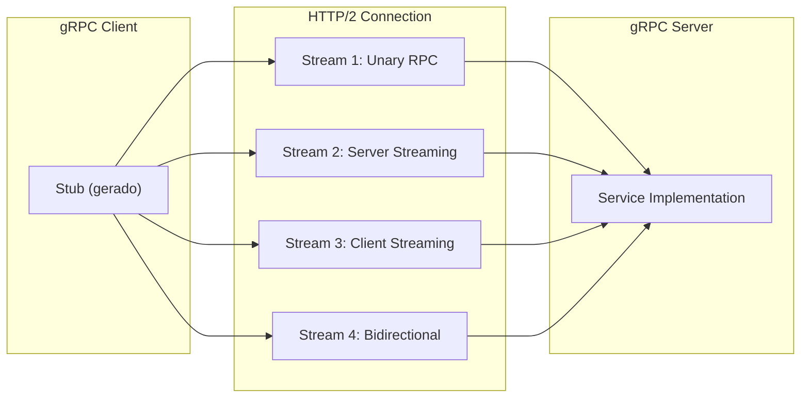
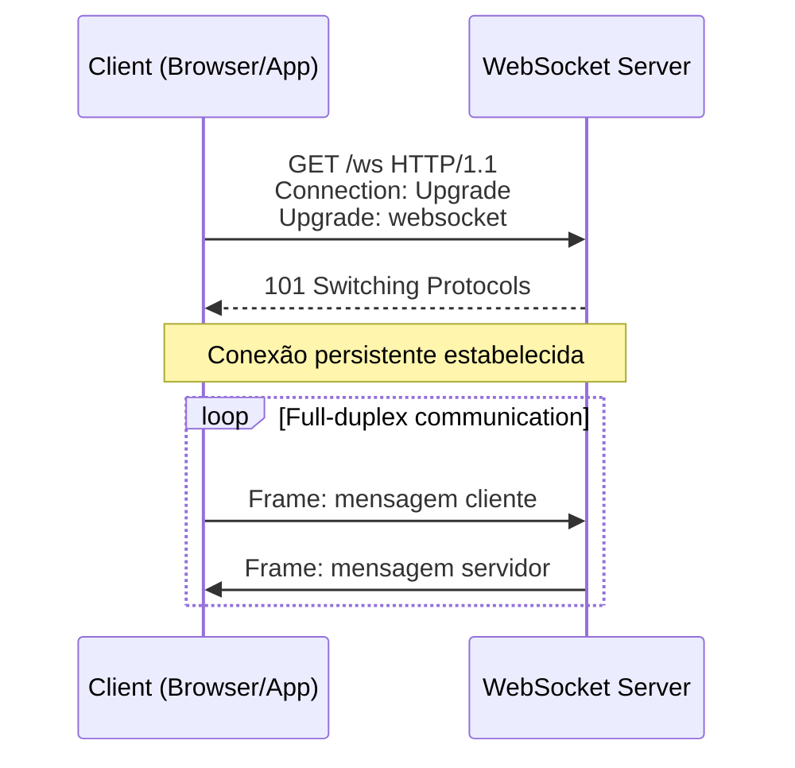
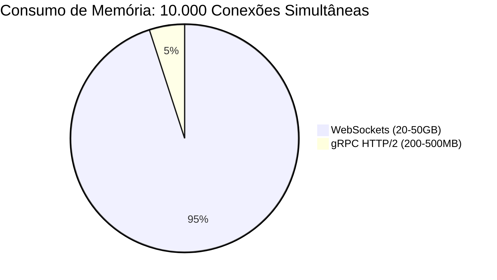
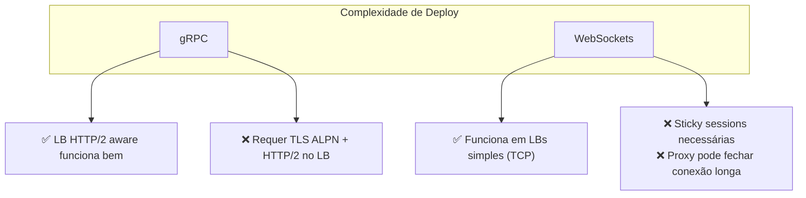
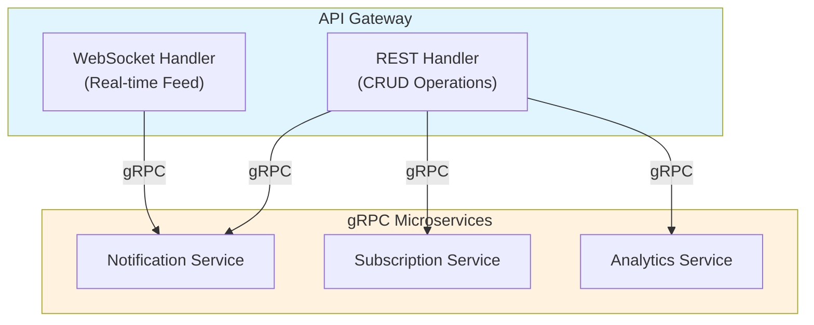
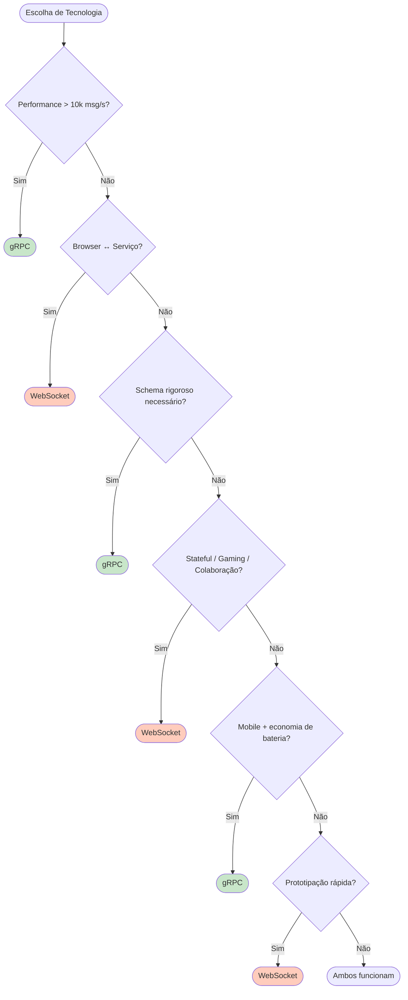

# gRPC vs WebSockets: Análise Comparativa para Comunicação em Tempo Real

Análise técnica detalhada comparando gRPC e WebSockets para comunicação bidirecional, streaming e cenários de baixa latência entre serviços.

---

## 1. Visão Geral

| Aspecto | gRPC | WebSockets |
|---|---|---|
| **Camada de transporte** | HTTP/2 | TCP (com handshake HTTP de upgrade) |
| **Modelo de comunicação** | RPC (Remote Procedure Call) | Socket bidirecional persistente |
| **Protocolo de dados** | Protobuf (binário) | Texto ou binário customizado |
| **Direção** | Client-server com streaming nativo | Full-duplex verdadeiro |
| **State** | Stateless (conexões podem ser reabertas) | Stateful (conexão persistente) |

---

## 2. Arquitetura e Modelo de Comunicação

### 2.1 gRPC

**Características:**
- Baseado em contratos Protobuf (`.proto`)
- Múltiplos streams multiplexados em uma única conexão HTTP/2
- Cada RPC é independente (mesmo na mesma conexão)
- Deadlines/Timeouts por chamada

### 2.2 WebSockets

**Características:**
- Handshake HTTP inicial com upgrade para TCP persistente
- Mensagens em frames (texto ou binário)
- Sem schema definido (custom protocol necessário)
- Conexão stateful — se cair, estado é perdido

---

## 3. Performance

### 3.1 Latência e Throughput

| Métrica | gRPC | WebSockets |
|---|---|---|
| **Handshake inicial** | TLS + HTTP/2 (~2-3 RTT) | HTTP Upgrade + TLS (~2-3 RTT) |
| **Overhead por mensagem** | ~5 bytes (Protobuf framing) | ~2-14 bytes (WebSocket frame header) |
| **Serialização** | Protobuf (binário otimizado) | JSON/MessagePack/Protobuf custom |
| **Throughput** | ~100k-500k msg/s | ~10k-50k msg/s (depende de implementação) |
| **Compressão** | Inerente (HTTP/2 HPACK) | Opcional (per-message deflate) |

**Vencedor**: gRPC para throughput massivo; WebSocket aceitável para casos simples.

### 3.2 Utilização de Recursos

| Aspecto | WebSockets | gRPC HTTP/2 |
|---|---|---|
| Conexões TCP | 10.000 sockets | 1.000 conexões (10 streams cada) |
| Threads/Goroutines | 10.000 | ~100-200 (multiplexing) |
| Memória por conexão | ~2-5MB | ~200-500KB |
| Memória total estimada | 20-50GB | 200-500MB |

**Vencedor**: gRPC escala melhor em cenários de muitos clientes.

---

## 4. Casos de Uso e Adequação

### 4.1 Quando usar gRPC

| Cenário | Justificativa |
|---|---|
| **Microserviços internos** | Contratos rigorosos, alta performance, load balancing |
| **Streaming de dados estruturados** | Server/client/bidi streaming com backpressure |
| **Alta frequência de mensagens** | Protobuf eficiente, HTTP/2 multiplexing |
| **Poliglotia (multi-language)** | Stubs gerados automaticamente para 10+ linguagens |
| **Mobile para backend** | Bateria eficiente (menos dados, conexões reutilizadas) |

**Exemplos:**
- Telemetria de IoT (milhões de dispositivos)
- Streaming de logs/métricas (ELK, Prometheus)
- Comunicação service-mesh (Istio, Linkerd)

### 4.2 Quando usar WebSockets

| Cenário | Justificativa |
|---|---|
| **Chat em tempo real** | Full-duplex nativo, simples de implementar |
| **Gaming multiplayer** | Baixa latência, state compartilhado na conexão |
| **Collaborative editing** | Broadcast eficiente para múltiplos clients |
| **Notificações push** | Browser suporta nativamente (Socket.IO, etc.) |
| **Dashboards ao vivo** | Conexão persistente, fácil reconexão client-side |

**Exemplos:**
- Slack/Discord (antes de migrarem para protocolos custom)
- Google Docs (Operational Transform)
- Trading platforms (cotações em tempo real)

---

## 5. Developer Experience

### 5.1 Implementação

| Aspecto | gRPC | WebSockets |
|---|---|---|
| **Definição de API** | `.proto` — contrato formal | Manual — schema ad-hoc |
| **Code generation** | ✅ Stubs client/server automáticos | ❌ Manual (ou Socket.IO) |
| **Type safety** | ✅ Compile-time | ❌ Runtime (JSON) |
| **Debugging** | grpcurl, Evans, reflection | Browser DevTools, Wireshark |
| **Testing** | Unit tests com stubs mockados | Requer setup de conexão real |

### 5.2 Complexidade de Deploy

---

## 6. Resiliência e Production Readiness

### 6.1 Reconexão e Retry

| Capacidade | gRPC | WebSockets |
|---|---|---|
| **Reconexão automática** | ✅ Built-in (exponential backoff) | ❌ Implementar manualmente |
| **Retry semantics** | ✅ Idempotência + deadlines | ❌ Manual |
| **Health checking** | ✅ gRPC health protocol | ❌ Ping/pong custom ou Heartbeat |
| **Circuit breaker** | ✅ Client-side libraries | ❌ Implementar na aplicação |

### 6.2 Observabilidade

| Métrica | gRPC | WebSockets |
|---|---|---|
| **Tracing distribuído** | ✅ Metadata gRPC nativa | ⚠️ Custom headers no handshake |
| **Métricas RPC** | ✅ Status codes padronizados | ❌ Sem padrão |
| **Logging estruturado** | ✅ Interceptors | ⚠️ Middleware manual |
| **Profilling** | ✅ gRPC channelz | ❌ Custom instrumentation |

---

## 7. Segurança

| Aspecto | gRPC | WebSockets |
|---|---|---|
| **TLS** | ✅ TLS 1.3 (ALPN requer h2) | ✅ wss:// (TLS padrão) |
| **Autenticação** | ✅ Interceptors (JWT, mTLS, etc.) | ⚠️ Custom no handshake ou msg |
| **Autorização** | ✅ Por-RPC | ⚠️ Conexão-level ou msg-level |
| **Rate limiting** | ✅ Por-RPC fácil | ⚠️ Conexão-level ou msg-level |

**gRPC vence**: Segurança mais granular (por RPC vs por conexão).

---

## 8. Cenários Híbridos

### Quando combinar ambos

**Padrão comum:**
- WebSocket para frontend → streaming de eventos
- gRPC para backend → comunicação entre microserviços

---

## 9. Matriz de Decisão

---

## 10. Conclusão

| Dimensão | Vencedor |
|---|---|
| Performance | gRPC |
| Escalabilidade | gRPC |
| Type safety | gRPC |
| DX (produção) | gRPC |
| Simplicidade inicial | WebSocket |
| Browser nativo | WebSocket |
| Full-duplex "puro" | WebSocket |
| Resiliência built-in | gRPC |

**Regra prática:**
- **gRPC** para backend-backend e mobile-backend em escala
- **WebSocket** para browser-realtime e prototipação rápida
- **Ambos** em arquiteturas modernas (WebSocket no edge, gRPC no core)

Este POC utiliza gRPC em sua sweet spot: comunicação eficiente entre microserviços heterogêneos, com streaming nativo para notificações em tempo real via `StreamNotifications` e `NotificationChannel`.
