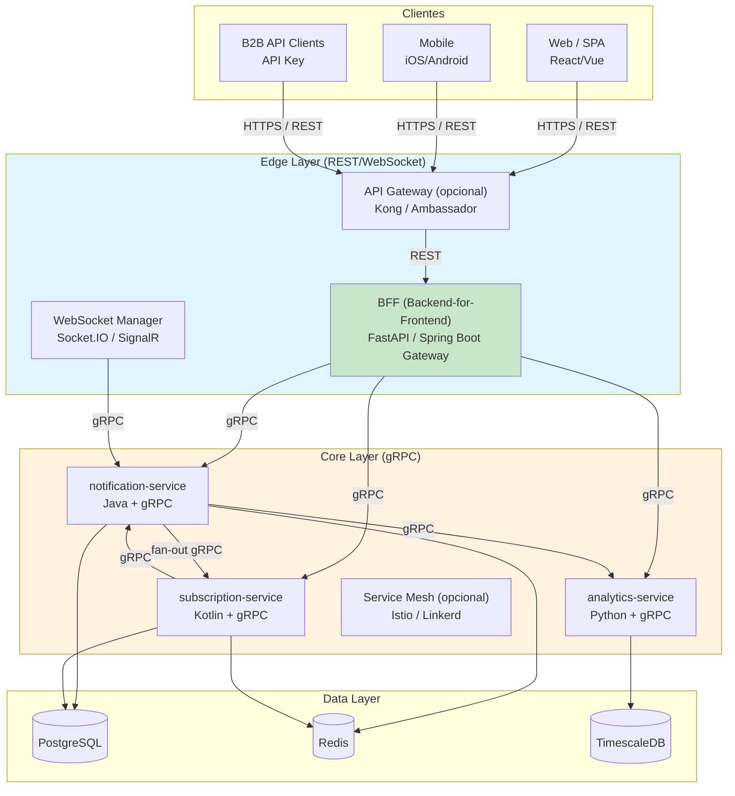
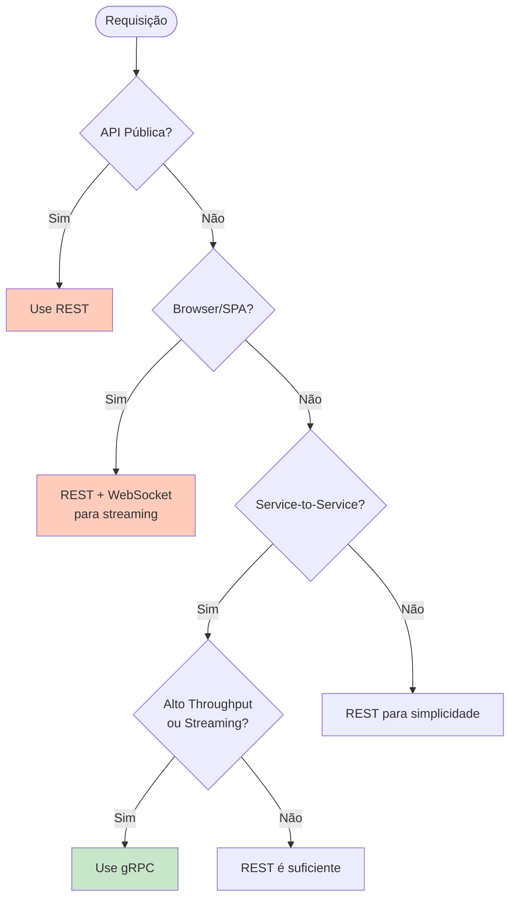
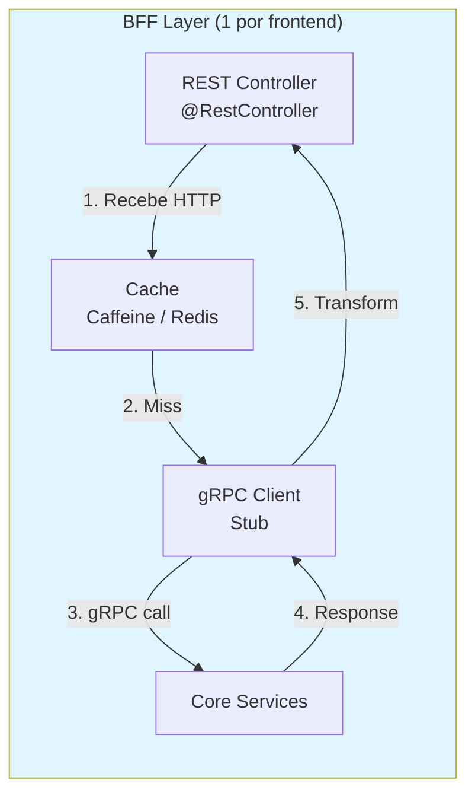
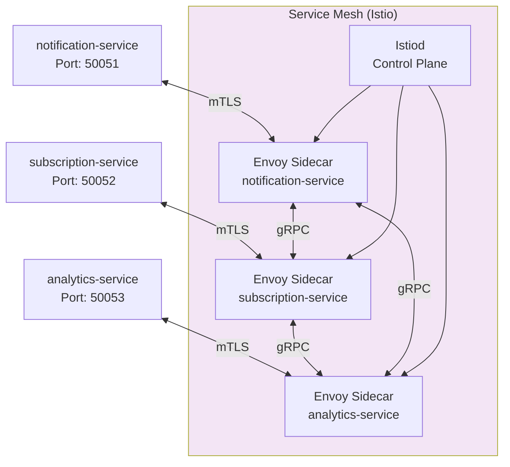
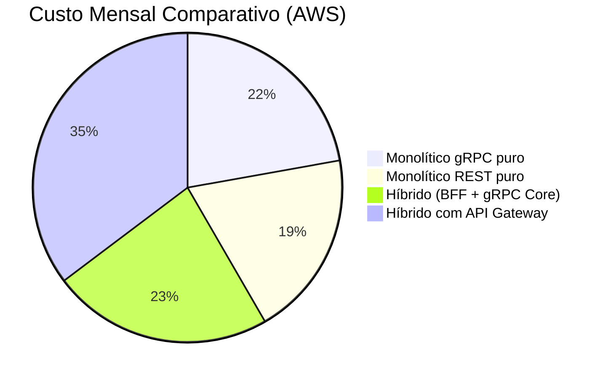
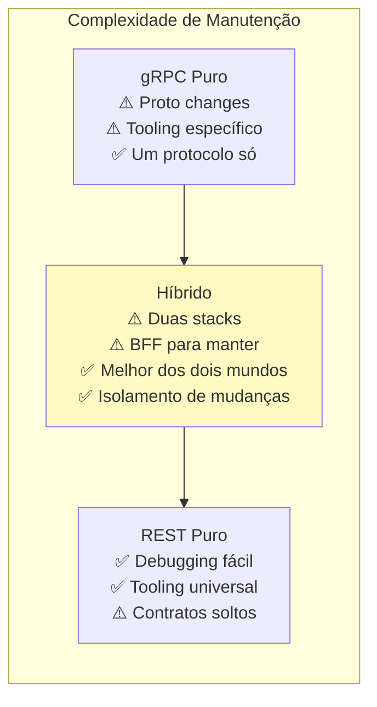
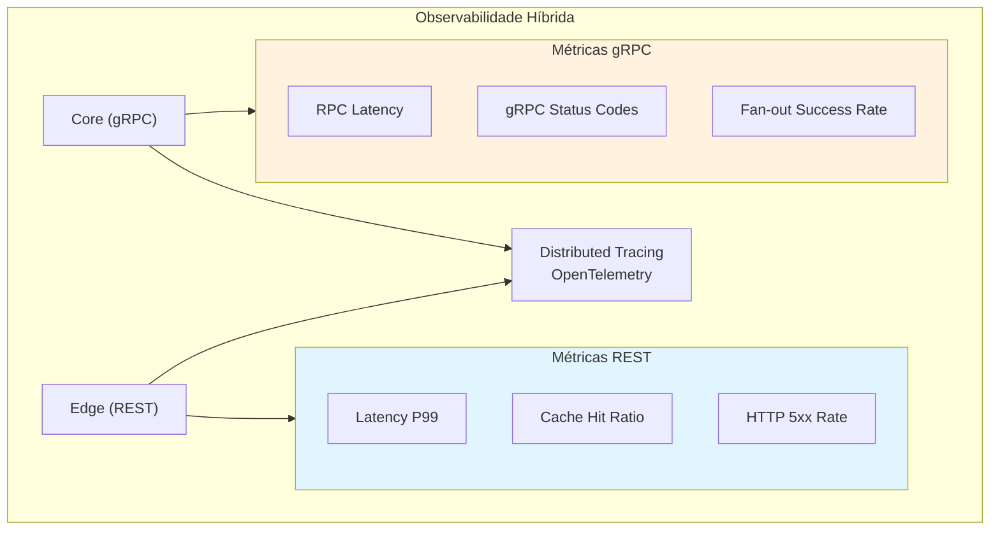
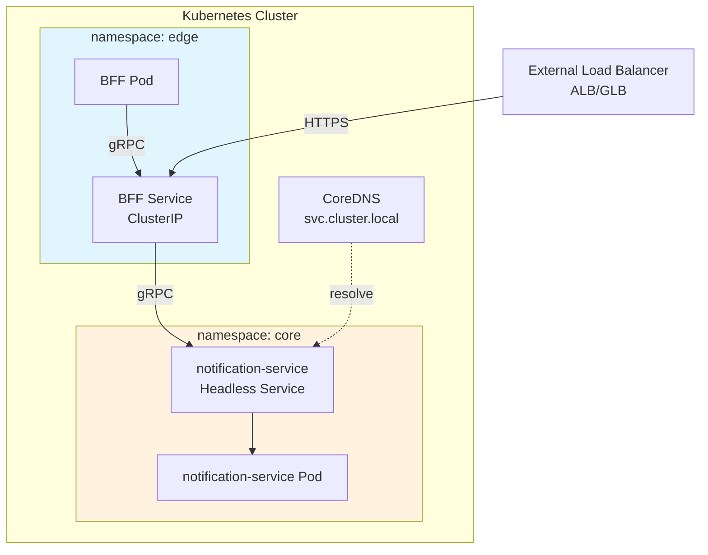

# Arquitetura Híbrida Ideal: gRPC + REST

Documento de arquitetura propondo uma abordagem híbrida que combina gRPC e REST de forma estratégica, otimizando custos, manutenção e performance para diferentes camadas do sistema.

---

## 1. Visão Geral da Arquitetura Híbrida

### 1.1 Princípios

1. **Use o protocolo certo para o job certo** — não force tudo em um único paradigma
2. **Edge = REST** — APIs públicas e browsers usam REST/WebSocket
3. **Core = gRPC** — Comunicação service-to-service usa gRPC
4. **Custo consciente** — Evite serviços caros de gateway quando possível
5. **Manutenção simplificada** — Reduza camadas de tradução desnecessárias

### 1.2 Diagrama da Arquitetura



---

## 2. Separação de Responsabilidades

### 2.1 Matriz de Decisão: REST vs gRPC



### 2.2 Responsabilidades por Protocolo

| Aspecto | REST (Edge) | gRPC (Core) |
|---|---|---|
| **Autenticação** | OAuth 2.0 / JWT / API Keys | mTLS + JWT metadata |
| **Rate Limiting** | Por client (API Gateway) | Por serviço (service mesh) |
| **Payload** | JSON (legível, debugável) | Protobuf (eficiente) |
| **Caching** | HTTP Cache-Control, ETag | Application-level caching |
| **Observabilidade** | Access logs, HTTP metrics | gRPC metrics, distributed tracing |
| **Versioning** | URL / Header versioning | Protobuf evolution |

---

## 3. Componentes da Arquitetura

### 3.1 BFF (Backend-for-Frontend)

**Propósito:** Camada de tradução entre REST público e gRPC interno.



**Implementação (Spring Boot):**

```java
@RestController
@RequestMapping("/api/v1/notifications")
public class NotificationBffController {
    
    @Autowired
    private NotificationServiceGrpc.NotificationServiceBlockingStub grpcClient;
    
    @GetMapping
    public ResponseEntity<List<NotificationDTO>> list(
            @RequestHeader("Authorization") String token,
            @RequestParam String userId) {
        
        // Transforma REST em gRPC
        StreamNotificationsRequest request = StreamNotificationsRequest.newBuilder()
            .setUserId(userId)
            .setMinPriority(NotificationPriority.NORMAL)
            .build();
        
        // Chama serviço gRPC
        Iterator<Notification> responses = grpcClient.streamNotifications(
            request,
            createMetadata(token)  // JWT forwarding
        );
        
        // Transforma gRPC em REST
        List<NotificationDTO> dtos = new ArrayList<>();
        responses.forEachRemaining(n -> dtos.add(toDTO(n)));
        
        return ResponseEntity.ok()
            .cacheControl(CacheControl.maxAge(30, TimeUnit.SECONDS))
            .body(dtos);
    }
}
```

**Vantagens do BFF:**
- **Caching HTTP** no edge reduz chamadas gRPC internas
- **Agregação** de múltiplos serviços em um endpoint REST
- **Transformação** de payload (Protobuf ↔ JSON) em um ponto só
- **Versioning REST** sem afetar serviços core

### 3.2 Service Mesh (Opcional)

Quando usar: >10 serviços, necessidade de mTLS automático, canary deployments.



---

## 4. Análise de Custos (Híbrido vs Monolítico)

### 4.1 Custo por Arquitetura

Estimativa para: 10M notificações/dia, 3 serviços, 3 AZs, 500 conexões simultâneas.



| Arquitetura | Componentes | Custo AWS/mês | Custo GCP/mês | Custo Azure/mês |
|---|---|---|---|---|
| **gRPC puro** | EKS + NLB + X-Ray | $327 | $258 | $280 |
| **REST puro** | ECS + ALB + ElastiCache | $287 | $240 | $376 |
| **Híbrido** | EKS + 1 ALB (BFF) + NLB (core) + Redis | $340 | $275 | $320 |
| **Híbrido + Kong** | EKS + Kong + NLB + Redis | $380 | $315 | $360 |

### 4.2 Justificativa do Custo Adicional do Híbrido

O híbrido custa ~5-15% a mais que puro, mas entrega:

| Benefício | Valor |
|---|---|
| **Caching no edge** | Reduz 30-50% das chamadas gRPC |
| **BFF por cliente** | Mobile e Web podem ter APIs otimizadas |
| **Debuggabilidade** | REST no edge permite curl/browser |
| **Segurança** | mTLS no core, OAuth no edge |

**ROI:** O custo extra do ALB é compensado pela redução de chamadas gRPC (caching) e pela facilidade de debugging.

---

## 5. Manutenção e Operação

### 5.1 Complexidade Operacional



### 5.2 Estratégia de Deploy

| Mudança | Impacto | Estratégia |
|---|---|---|
| **Atualizar proto** | Core services | Canary deployment via service mesh |
| **Mudar REST API** | BFF apenas | Blue/green no BFF, core intacto |
| **Novo endpoint** | BFF + Core | Proto primeiro, BFF depois |
| **Bug no core** | Rollback rápido | Rollback gRPC sem afetar REST |

### 5.3 Monitoramento



**Stack recomendada:**
- **Edge:** Prometheus + Grafana (métricas HTTP)
- **Core:** OpenTelemetry + Jaeger (tracing gRPC)
- **Unified:** ELK ou Loki para logs estruturados

---

## 6. Implementação Prática

### 6.1 Estrutura de Código

```
notification-system/
├── edge/
│   ├── web-bff/                 # Spring Boot/FastAPI
│   │   ├── src/
│   │   │   ├── rest/           # Controllers REST
│   │   │   └── grpc/           # Client stubs gRPC
│   │   └── proto/              # Proto files (submodule)
│   └── mobile-bff/             # BFF otimizado para mobile
│
├── core/
│   ├── notification-service/   # Java + gRPC
│   ├── subscription-service/   # Kotlin + gRPC
│   └── analytics-service/      # Python + gRPC
│
├── infra/
│   ├── k8s/                    # Kubernetes manifests
│   ├── terraform/              # IaC para AWS/GCP/Azure
│   └── istio/                  # Service mesh config (opcional)
│
└── proto/                      # Contratos compartilhados
    ├── notification/v1/
    ├── subscription/v1/
    └── analytics/v1/
```

### 6.2 Deploy no Kubernetes

```yaml
# BFF Deployment
apiVersion: apps/v1
kind: Deployment
metadata:
  name: notification-bff
spec:
  replicas: 2
  template:
    spec:
      containers:
      - name: bff
        image: notification-bff:1.0.0
        ports:
        - containerPort: 8080  # REST
        env:
        - name: NOTIFICATION_SERVICE_HOST
          value: "notification-service.core.svc.cluster.local:50051"
        - name: SUBSCRIPTION_SERVICE_HOST
          value: "subscription-service.core.svc.cluster.local:50052"
---
# Core Service
apiVersion: apps/v1
kind: Deployment
metadata:
  name: notification-service
  namespace: core
spec:
  replicas: 3
  template:
    spec:
      containers:
      - name: service
        image: notification-service:1.0.0
        ports:
        - containerPort: 50051  # gRPC
        - containerPort: 8080   # Health/metrics
```

### 6.3 Service Discovery



---

## 7. Roadmap de Implementação

### Fase 1: Foundation (Semana 1-2)
- [ ] Setup Kubernetes cluster (EKS/GKE/AKS)
- [ ] Deploy core services com gRPC
- [ ] Service mesh básico (opcional)

### Fase 2: Edge Layer (Semana 3-4)
- [ ] Implementar BFF (1 por cliente principal)
- [ ] Configurar ALB/GLB para REST
- [ ] Setup caching (Redis)

### Fase 3: Observabilidade (Semana 5)
- [ ] OpenTelemetry collector
- [ ] Jaeger para tracing
- [ ] Grafana dashboards (REST + gRPC)

### Fase 4: Produção (Semana 6)
- [ ] Rate limiting no edge
- [ ] mTLS no core
- [ ] Canary deployments

---

## 8. Conclusão

A arquitetura híbrida **gRPC (core) + REST (edge)** oferece:

| Aspecto | Avaliação |
|---|---|
| **Performance** | ⭐⭐⭐⭐⭐ gRPC no core entrega máxima eficiência |
| **Custo** | ⭐⭐⭐⭐☆ ~10% mais caro que puro, mas com ROI positivo |
| **Manutenção** | ⭐⭐⭐⭐☆ Isolamento de mudanças compensa duas stacks |
| **Debuggabilidade** | ⭐⭐⭐⭐⭐ REST no edge permite debugging rápido |
| **Escalabilidade** | ⭐⭐⭐⭐⭐ Cada camada escala independentemente |

**Recomendação final:** Adote o híbrido se você tem múltiplos clientes (Web, Mobile, B2B) e precisa de performance interna sem sacrificar debuggabilidade. O investimento no BFF paga dividendos em isolamento de mudanças e caching eficiente.
